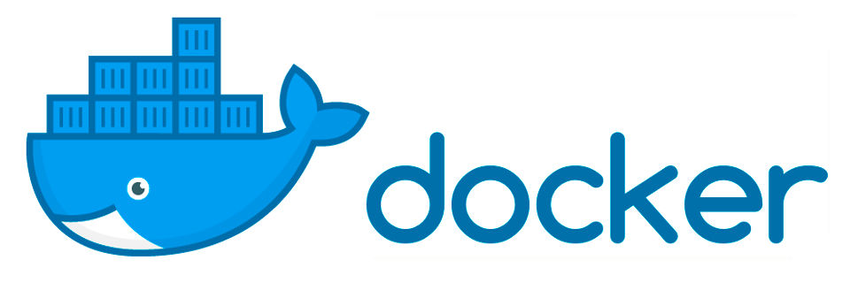

<p align="center">
  </a>
</p>

## 📝 Contexto do desafio

Após a configuração inicial do DevContainer para o Kube News, a equipe da Rota42 identificou que, embora o ambiente de desenvolvimento esteja funcionando perfeitamente, a transição para o ambiente de produção ainda não está bem definida.

Atualmente, o mesmo Dockerfile está sendo utilizado para desenvolvimento e produção, o que não é uma boa prática, pois ambientes distintos possuem necessidades diferentes. O ambiente de desenvolvimento precisa de ferramentas adicionais, como hot reload, enquanto a versão de produção deve ser otimizada, contendo apenas o necessário para rodar a aplicação com segurança e eficiência.

Para resolver isso, será necessário separar os ambientes, criando uma estrutura onde seja possível alternar facilmente entre desenvolvimento e produção utilizando Docker Compose e o DevContainer.

---

## 💥 Missão

- [x] Criar dois Dockerfiles distintos:
   .devcontainer/Dockerfile.dev → Contendo ferramentas de desenvolvimento, como hot reload.
   Dockerfile → Otimizado para produção, sem dependências desnecessárias.
- [x] Criar um compose.yml para rodar a aplicação no ambiente de produção, garantindo que todas as dependências sejam carregadas corretamente.
- [x] Criar um .devcontainer/docker-compose.override.yml para modificar o comportamento do compose.yml, permitindo que o ambiente funcione corretamente no modo desenvolvimento com o DevContainer.
- [x] Adicionar variáveis de ambiente para que seja possível diferenciar os dois ambientes.
- [x] Documentar as instruções de uso no README.md, explicando claramente:
   Como rodar o ambiente em produção usando compose.yml.

## 📦 Estrutura do Projeto

```
/
├── .devcontainer/                           # Pasta para montagem de ambiente de homologação
│   ├── devcontainer.json
│   ├── docker-compose.override.yml
│   ├── Dockerfile.dev
├── src/                                     # Código-fonte principal
│   ├── models/               
│   ├── static        
│   ├── views          
│   ├── middleware.js     
│   └── package-lock.json
│   └── package.json                        # Arquivos de dependências instaladas no projeto 
│   └── server.js                           # Arquivo de inicialização do projeto 
│   └── system-life.js
└── .gitignore
└── compose.yml                              # Montagem do ambiente de produção
└── Dockerfile                               # Montagem da imagem da aplicação
└── LICENSE                                  # Licença da aplicação
└── popula-dados.http                        # Arquivo de população de dados
└── README.md                                # Documentação do projeto
```

## 🏗️ Montagem e execução do ambiente

Como um dos principais própositos do projeto é ter dois ambientes (Homologação e Produção), a execução de ambos são baseados por variáveis inseridos nos arquivos de configuração de ambiente (.env). 

A montagem dos ambientes está vinculada aos arquivos compose.yml que possuem variaveis NODE_ENV informando qual ambiente será montado mas caso queira executa via terminal, é só seguir as orientações abaixo:

<h4>Produção</h4>

> ```console
> $ docker-compose -f compose.yml --env-file .env up --build -d
> ```

<h4>Hologação</h4> 

> ```console
> $ docker-compose -f compose.yml -f .devcontainer/docker-compose.override.yml --env-file .devcontainer/.env up --build
> ````

<h4>Explicação rápida dos parâmetros</h4> 

| Flag | Significado |
|----------|-----------|
| -f compose.yml | Arquivo base com serviços completos (inclui banco, redes, etc) |
| -f .devcontainer/docker-compose.override.yml | Override específico para ambiente de desenvolvimento/homologação |
| --env-file .devcontainer/.env | Usa o arquivo .env que está dentro da pasta .devcontainer/ |
| --build | Reconstrói as imagens para aplicar mudanças no código ou dependências |

---

## 🚨 Segurança

Este repositório tem como objetivo demonstrar a criação e configuração de containers e imagens Docker. Alguns arquivos foram incluídos apenas para fins ilustrativos. Jamais publique arquivos sensíveis em repositórios públicos, pois isso pode acarretar sérios riscos de segurança.
